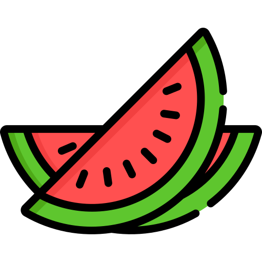
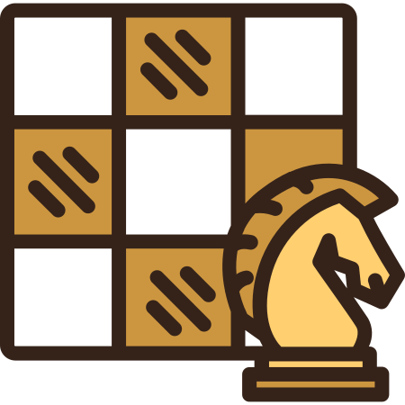

## Boas Vindas!👋

### Meu nome **Bruno** e sou um desenvolvedor front-end apaixonado por melancia 

**Meus interesses pessoais:**
 
 

  

- 👨🏽‍💻 Atualmente estou me capacitando para ser um **Desenvolvedor Fullstack Júnior** com a ajuda da [Trybe](https://www.betrybe.com/) 🚀;
- 🌱 No momento estou estudando a parte de back-end com **Express** que é um framework em **Node.js**;
- 🤔 Meu hobbie é jogar xadrez;
- 💼 Estou sempre em busca de conhecimento para evoluir na minha carreira de desenvolvedor;
- 💬 Pergunte-me sobre qualquer coisa, adoro conversar;
- 📫 Por favor, envie um email para bruno.wesley77@gmail.com para me encontrar.
- 📝 Veja meu <a href="https://gitconnected.com/brunodantass/resume" target="_blank">Curriculum Vitae</a> para mais informações.

 
 
 

**Linguagens e ferramentas:**  

   
   
   
  
   
   
    
  
  

 
 

    
    

  

 
 

⭐️ Baseado em [Johnatas Henrique](https://github.com/johnatas-henrique)
